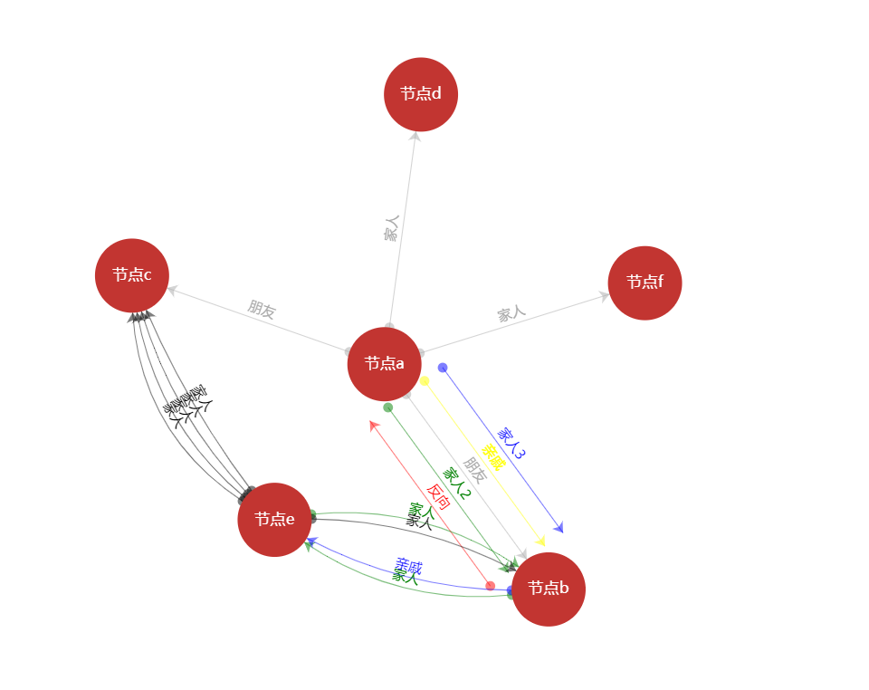

### Echart Graph 支持节点之间多边
#### Echart 版本 4.7.0
#### 修改代码：
- src/data/Graph.js  -----解决可以添加重复边
- src/chart/graphHelper.js -----修改重复边绘制位置，解决重复变重叠显示问题
- src/chart/circularLayoutHelper.js  ----- 不同视图引用
- src/chart/simpleLayoutHelper.js   ----- 不同视图引用
- src/chart/forceHelper.js   ----- 不同视图引用
#### 验证情况：
- 只在forceLayout视图模式，其他视图请自行验证
- 正向、逆向、弧线情况
- 只限制关系在3000以内使用，3000以外效率问题没验证
- 为避免修改源码过多，代码尽量在一个文件修改，其他地方引用，实现可再优化，可根据实际情况再定
- 目前只定义了一个上下移动边的固定阀值10,20，按理需要根据当前缩放比例计算该阀值，此处没处理
##### 演示文件
- index.html

##### 效果图

##### 调试、打包
- npm run release 打包所有
- npm run watch 本地调试
